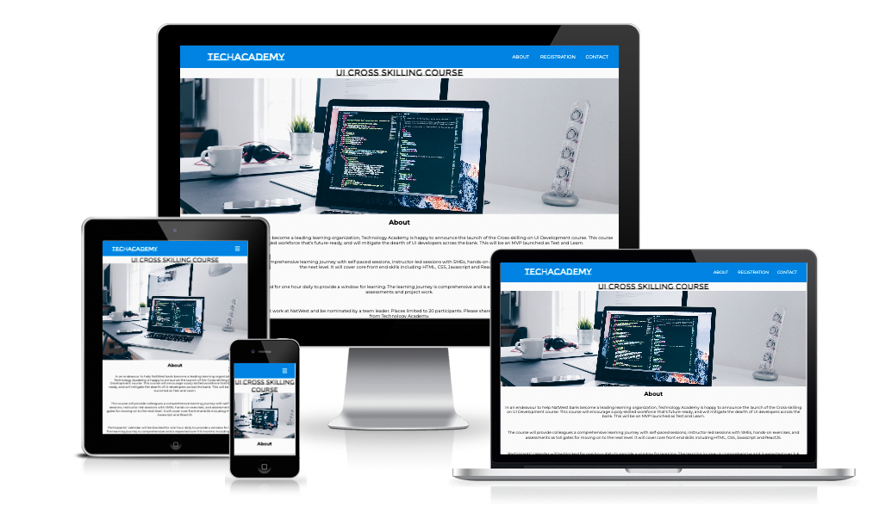

# Tech Academy - Cross-Skilling UI Development Course

## Introduction

This static website was built as part of the UI Cross-Skilling Course for Natwest Employees.  The objective and user stories for the project are set out below. 

### Objective:  

To build a course details and registration webpage. 

Note: There is no any restriction in design. You can add your own styles like colors, font, icons, etc. This application should be ideal for desktop. Adding responsive media queries is optional. 

 

### User stories: 

1. Should have header section with any logo on left side. 

2. Should have navbar three nav options (About, Registration, Contact) on right side. Please find more details about each nav option below: 

    - Each nav option should be an internal navigation and click of each option should navigate in the same page. 

    - About page: Should have course details like Name of the course, eligibility, Introduction, etc. This should be the default landing page. 

    - Registration form: Should contains below mentioned fields and it's type. 

        - Name - Mandatory input field. 

        - Email - Mandatory e-mail input field. It should accept only e-mail address format. 

        - Date of birth - calendar field 

        - Current role - Dropdown field with values (student, Full time job, Part time job, others) 

        - Would you recommend this course to a friend? - Radio field with options (Definitely, Maybe, Not sure) 

        - Any comments or suggestions? - Textarea field with maximum 500 characters. 

        - I have read terms and conditions. - checkbox field. 

        - Submit - Button with no actions required. 

    - Contact page: Should have contact details like phone numbers, e-mail and other social media ID's. 

3. Should have footer with additional web page details like copyright, author details, etc. 

### Credits

* [Pixabay](https://pixabay.com/) for the image used on the landing page.
* [Googlefonts](https://fonts.google.com/) for the Montserrat and Montserrat Subrayada fonts used in the body and page logo.
* Inspiration from CodeNepal on Youtube for the responsive navbar using only HTML and CSS.
* [Favicon](Favicon.io )
* [FontAwesome](https://fontawesome.com/) for icons.